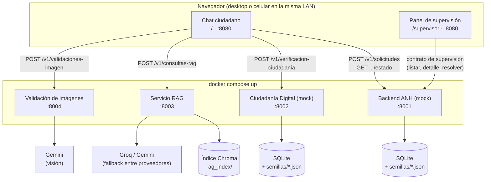

# Asistente ANH

Prototipo de un **asistente conversacional basado en LLM + RAG** para el
trámite de **registro de consumo de combustibles líquidos fuera de tanque**
ante la ANH (Agencia Nacional de Hidrocarburos, Bolivia).

Trabajo académico de maestría (UNIR). **Nunca se integra con los sistemas
reales de la ANH ni de AGETIC**: los servicios de esas dos entidades están
simulados de forma deliberada y permanente en este repositorio. El servicio
RAG, el servicio de validación de imágenes y la interfaz de chat, en cambio,
son los componentes reales que resuelven el trámite — no simulan nada
externo.

---

## Arquitectura general



| Servicio | Puerto | Naturaleza | Qué hace |
|---|---|---|---|
| **Backend ANH** | `8001` | Mock | Sistema de trámites de la entidad, simulado |
| **Ciudadanía Digital** | `8002` | Mock | Servicio de identidad de AGETIC, simulado |
| **RAG** | `8003` | Real | Motor de recuperación aumentada sobre el corpus normativo |
| **Validación de imágenes** | `8004` | Real | Verifica que la foto muestre rostro y cédula sin sobreposiciones |
| **Interfaz de chat** | `8080` | Real | HTML/CSS/JS vanilla; sirve el chat ciudadano (`/`) y el panel de supervisión (`/supervisor`) |

Los mocks no son implementaciones a medias: existen para que el asistente
tenga contra qué integrarse sin depender de los sistemas reales de la ANH o
AGETIC. El servicio RAG, el servicio de validación de imágenes y la interfaz
de chat son los componentes reales que resuelven el trámite. Dentro de esta
última, el chat ciudadano (`/`) y el
panel de supervisión (`/supervisor`) son dos aplicaciones vanilla separadas
servidas por el mismo proceso (`chat_web/server.py`), cada una contra su
propio contrato: el chat usa el contrato estándar de integración, el panel
usa el contrato interno de supervisión.

---

## Levantar el entorno

Requiere Docker y Docker Compose para los cuatro servicios backend, y Python
para la interfaz de chat (corre local, aparte).

**1. Servicios backend (mocks + RAG + validación de imágenes):**

```bash
cp .env.example .env   # completar GOOGLE_API_KEY y GROQ_API_KEY
docker compose up
```

Verificar que respondieron:

```bash
curl http://localhost:8001/health   # Backend ANH
curl http://localhost:8002/health   # Ciudadanía Digital
curl http://localhost:8003/docs     # RAG (sin /health; expone /v1/consultas-rag)
curl http://localhost:8004/docs     # Validación de imágenes (sin /health; expone /v1/validaciones-imagen)
```

**2. Interfaz de chat:**

```bash
python -m venv .venv && source .venv/bin/activate
pip install -r requirements.txt
cd src
uvicorn chat_web.server:app --port 8080 --reload
```

Abrir `http://localhost:8080`. Para probarla desde otro dispositivo en la
misma red (por ejemplo un celular), usar la IP de LAN de esta máquina en vez
de `localhost` — la interfaz resuelve las URLs de los cuatro servicios según
el hostname con el que se accedió a la página.

Todo corre local: sin hosting remoto, pensado para que cada integrante del
equipo lo levante en su propia máquina y grabe su demostración ahí.

---

## Contratos — fuente de verdad

Seis especificaciones OpenAPI 3.0.3 en [`/contratos`](contratos). Si el
código no coincide con la spec, se corrige el código, no la spec.

| Archivo | Servicio | Qué describe |
|---|---|---|
| `openapi-integracion.yaml` | Backend ANH (8001) | Contrato estándar: registrar un trámite y consultar su estado |
| `openapi-supervision-anh.yaml` | Backend ANH (8001) | Operaciones internas de supervisión: listar, ver detalle, resolver |
| `openapi-ciudadania-digital.yaml` | Ciudadanía Digital (8002) | Verificación de titularidad |
| `openapi-rag.yaml` | RAG (8003) | Consulta en lenguaje natural sobre el corpus normativo |
| `openapi-validacion-imagenes.yaml` | Validación de imágenes (8004) | Verifica que una foto muestre rostro y cédula sin sobreposiciones |
| `openapi-utilidades-prototipo.yaml` | Ambos mocks (8001, 8002) | `/health` y `/reiniciar`, sin equivalente en un sistema real |

Cada servicio expone además su documentación interactiva en `/docs`
(Swagger UI de FastAPI).

---

## Servicio RAG

Motor de recuperación aumentada sobre el corpus normativo
(`src/rag/corpus`, `.md` chunkeado por artículo e indexado en Chroma). Se
abstiene explícitamente cuando no encuentra información relevante, en vez de
inventar contenido.

El corpus curado cubre cuatro fuentes: el Reglamento RAN-ANH-DJ-UGJN
N° 0008/2025, el Decreto Supremo N° 5400, la Resolución AGETIC/RA/0027/2026
(Ciudadanía Digital) y un comunicado de la ANH sobre plazos de registro, más
un glosario de siglas y el catálogo de actividades del formulario
(`catalogos/actividades.json`) — estos dos últimos generados en el ingest,
no documentos oficiales, y por eso excluidos de la lista de "Fuentes" que
ve el ciudadano (ver "Optimizaciones" abajo).

El índice **no** se reconstruye en cada arranque — es un paso manual:

```bash
cd src && python -m rag.ingest
```

Requiere `GOOGLE_API_KEY` y `GROQ_API_KEY` en `.env` (gratuitas, ver
[`CLAUDE.md`](CLAUDE.md) para los enlaces). `LLM_PROVEEDORES` controla el
orden de fallback entre Groq y Gemini si uno satura o falla.

---

## Optimizaciones para mejorar las respuestas del asistente

Además de la arquitectura base (retrieval + generación), se aplicaron varias
técnicas puntuales para que las respuestas del RAG sean más fieles al
corpus, más consistentes entre corridas, y más fáciles de depurar cuando
algo sale mal. Resumen por categoría — el detalle completo, con la causa y
la evidencia de cada una, está en el historial de commits y en
[`CLAUDE.md`](CLAUDE.md):

**Consistencia de la generación**
- Temperatura de generación en `0` (antes `0.2`) tanto para la respuesta
  principal como para la reformulación de preguntas: con el mismo contexto
  recuperado, el modelo daba a veces una respuesta y a veces se abstenía sin
  motivo (variabilidad de muestreo, no un problema real de información) —
  confirmado empíricamente contra casos que fallaban de forma intermitente.
- El segundo intento de reformulación (cuando el primero devuelve la
  pregunta casi igual a la original, un "no-op") sí usa una temperatura más
  alta a propósito — a temperatura 0 ese reintento sería inútil, repetiría
  el mismo resultado.
- Reglas del prompt reforzadas contra la invención: prohibición explícita de
  completar campos vagos del corpus con ejemplos plausibles pero no
  verificados (el modelo llegó a inventar qué fotos adicionales pediría el
  formulario), y prohibición de comentar el origen de la información
  ("según los documentos que compartiste", una frase confusa y falsa en
  este contexto).
- Mensajes fijos (abstención, nota "orientativa", advertencia de fallo
  transitorio) sacados de la redacción libre del LLM y fijados como texto
  determinístico en backend/frontend — antes cada uno salía con formato y
  redacción distintos en cada respuesta.

**Retrieval afinado con datos**
- Golden set de preguntas con la norma/artículo esperado
  (`src/rag/evaluacion/golden_set.json` +
  `python -m rag.evaluacion.evaluar_retrieval`), usado para ajustar `k`
  (3 → 5) y el umbral de similitud (0.3 → 0.45) con evidencia medible en vez
  de a ojo. Complementado con
  [`src/rag/evaluacion/preguntas-rag.md`](src/rag/evaluacion/preguntas-rag.md),
  20 preguntas en lenguaje natural para revisar en vivo el pipeline completo
  (retrieval + generación), agrupadas por categoría normativa e incluyendo
  casos borde.
- Fallback de reformulación de pregunta cuando la búsqueda inicial no
  encuentra nada por encima del umbral, con reintento automático.
- Umbral separado y más estricto (`RAG_UMBRAL_FUENTES`) solo para decidir
  qué chunks se muestran como "Fuentes" al ciudadano — no afecta el
  contexto real que recibe el LLM, evita listar chunks temáticamente
  cercanos pero no citados en la respuesta.
- Corrección de un bug real en `ingest.py`: no borraba el índice anterior
  antes de reconstruirlo, así que reconstrucciones sucesivas duplicaban
  todos los chunks y degradaban silenciosamente la calidad del retrieval.

**Curación del corpus**
- Chunks divididos por sub-tema en vez de agrupados: un chunk con varios
  temas distintos diluye la señal de similitud para cualquier pregunta
  específica (pasó con el glosario de siglas, el catálogo de actividades, y
  el chunk "cómo se hace el registro", que llegó a mezclar cuatro temas).
- Contenido agregado para cerrar huecos reales que antes llevaban a
  respuestas inventadas: la única fotografía exigida por el Formulario
  Electrónico (titular sosteniendo su CI), el carácter personal e
  intransferible del registro, que el registro no tiene fecha límite, y qué
  pasa si el consumidor ya excedió su cupo mensual.
- El glosario y el catálogo de actividades se marcan como contenido no
  normativo (`es_normativo: false`) y se excluyen de "Fuentes", aunque
  sigan disponibles como contexto para el LLM.

**Fiabilidad ante fallos de proveedor**
- Fallback entre Groq y Gemini con reintentos y backoff exponencial ante
  errores transitorios (saturación, límite de tasa, timeout).
- Aviso explícito (caption en rojo, "Los proveedores LLM no respondieron")
  cuando el fallback de reformulación falla por agotamiento de todos los
  proveedores — antes era indistinguible de una abstención genuina por
  falta de información en el corpus.

---

## Servicio de validación de imágenes

Verifica que la foto que el ciudadano sube en el chat muestre, con claridad
y sin sobreposiciones, un rostro humano y una cédula de identidad. Es un
pre-filtro automático de presencia y oclusión, no un reemplazo del criterio
del evaluador humano sobre la foto.

Se llama desde la interfaz de chat antes de enviar la solicitud a Backend
ANH: si la foto no pasa la validación, o el servicio no responde, el chat no
avanza y pide otra foto. Reusa `GOOGLE_API_KEY` (mismo proveedor, Gemini, que
sí tiene soporte de visión — a diferencia del modelo de Groq usado en RAG).

---

## Datos de ejemplo (semillas)

Los mocks arrancan con datos precargados desde [`/semillas`](semillas), con
códigos de trámite fijos para que las demostraciones sean reproducibles:

| Código | Estado | Solicitante |
|---|---|---|
| `ANH-2026-000001` | REGISTRADO | Juan Carlos Mamani Quispe |
| `ANH-2026-000002` | APROBADO | María Elena Choque Alanoca |
| `ANH-2026-000003` | RECHAZADO | Rodrigo Vargas Peñaranda |

`POST /reiniciar` en cada mock descarta lo acumulado en la sesión y recarga
las semillas (requiere `PERMITIR_REINICIO=true`, activo por defecto en
`docker-compose.yml`).

---

## Decisiones de diseño que conviene conocer

- **La validación normativa no vive en estos servicios.** Backend ANH valida
  solo la estructura de la solicitud, no los límites de volumen ni demás
  reglas del reglamento. El wizard de "Registrar formulario" sí avisa en el
  cliente si el volumen ingresado supera el cupo de la zona (frontera o no)
  antes de enviar, como guía para el ciudadano — no reemplaza la validación
  normativa autoritativa, que queda fuera de este repositorio (orquestador).
- **No hay webhooks ni notificación de eventos.** El seguimiento de un
  trámite es siempre por consulta activa, nunca push desde la entidad.
- **La consulta de estado no verifica titularidad.** El código de trámite es
  la única credencial — limitación explícita del prototipo.
- **CORS abierto (`allow_origins=["*"]`) en los cuatro servicios backend**,
  porque la interfaz de chat los llama directo desde el navegador. Sin
  impacto real de seguridad: es un prototipo local sin credenciales reales.
- **La validación de imágenes es un pre-filtro, no un reemplazo del
  evaluador.** Solo verifica presencia y oclusión de rostro/documento, no
  legibilidad fina ni que el rostro corresponda a la persona registrada.

Para el detalle completo de cada decisión, su razón, y las convenciones del
código, ver [`CLAUDE.md`](CLAUDE.md).

---

## Reportar un problema con el contrato

Si la implementación no coincide con lo que dice la especificación en
`/contratos`, o el contrato no cubre un caso necesario, avisar antes de
trabajar alrededor del problema — los cambios al contrato son cambios
públicos que afectan a los demás componentes del prototipo.
