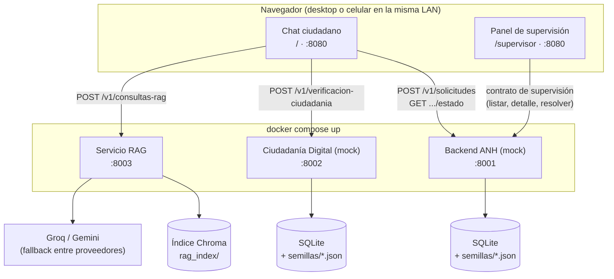

# Asistente ANH

Prototipo de un **asistente conversacional basado en LLM + RAG** para el
trámite de **registro de consumo de combustibles líquidos fuera de tanque**
ante la ANH (Agencia Nacional de Hidrocarburos, Bolivia).

Trabajo académico de maestría (UNIR). **Nunca se integra con los sistemas
reales de la ANH ni de AGETIC**: los servicios de esas dos entidades están
simulados de forma deliberada y permanente en este repositorio. El servicio
RAG y la interfaz de chat, en cambio, son los componentes reales que
resuelven el trámite — no simulan nada externo.

---

## Arquitectura general



| Servicio | Puerto | Naturaleza | Qué hace |
|---|---|---|---|
| **Backend ANH** | `8001` | Mock | Sistema de trámites de la entidad, simulado |
| **Ciudadanía Digital** | `8002` | Mock | Servicio de identidad de AGETIC, simulado |
| **RAG** | `8003` | Real | Motor de recuperación aumentada sobre el corpus normativo |
| **Interfaz de chat** | `8080` | Real | HTML/CSS/JS vanilla; sirve el chat ciudadano (`/`) y el panel de supervisión (`/supervisor`) |

Los mocks no son implementaciones a medias: existen para que el asistente
tenga contra qué integrarse sin depender de los sistemas reales de la ANH o
AGETIC. El servicio RAG y la interfaz de chat son los componentes reales que
resuelven el trámite. Dentro de esta última, el chat ciudadano (`/`) y el
panel de supervisión (`/supervisor`) son dos aplicaciones vanilla separadas
servidas por el mismo proceso (`chat_web/server.py`), cada una contra su
propio contrato: el chat usa el contrato estándar de integración, el panel
usa el contrato interno de supervisión.

---

## Arranque integrado de la V2

Desde esta carpeta, crear `.env` a partir de `.env.example` solo si aún no
existe. Completar las claves localmente para usar el RAG.

```bash
docker compose up -d --build
```

La interfaz se incluye en Compose: abrir http://localhost:8081 y
http://localhost:8081/supervisor. `CHAT_PORT` cambia el puerto publicado.
Para probar registro y supervisión sin RAG:

```bash
docker compose up -d --build backend-anh ciudadania-digital chat
```

Los puertos de los servicios se pueden configurar con `BACKEND_PORT`,
`CIUDADANIA_PORT` y `RAG_PORT` en `.env`; Compose aplica los mismos valores
al chat y al supervisor. Si 8001 está ocupado, usar `BACKEND_PORT=18001`.
En este equipo se utilizó esa alternativa para conservar la instancia anterior.

Las bases SQLite se guardan en volúmenes persistentes. `docker compose down`
conserva los datos; agregar `-v` los elimina. El índice RAG se construye en
la imagen Docker; la ingesta manual de abajo corresponde a ejecución local.

## Levantar el entorno manualmente

Requiere Docker y Docker Compose para los tres servicios backend, y Python
para la interfaz de chat (corre local, aparte).

**1. Servicios backend (mocks + RAG):**

```bash
cp .env.example .env   # completar GOOGLE_API_KEY y GROQ_API_KEY
docker compose up
```

Verificar que respondieron:

```bash
curl http://localhost:8001/health   # Backend ANH
curl http://localhost:8002/health   # Ciudadanía Digital
curl http://localhost:8003/docs     # RAG (sin /health; expone /v1/consultas-rag)
```

**2. Interfaz de chat:**

```bash
python -m venv .venv && source .venv/bin/activate
pip install -r requirements.txt
cd src
uvicorn chat_web.server:app --port 8080 --reload
```

Abrir `http://localhost:8080`. Para probarla desde otro dispositivo en la
misma red (por ejemplo un celular), usar la IP de LAN de esta máquina en vez
de `localhost` — la interfaz resuelve las URLs de los tres servicios según el
hostname con el que se accedió a la página.

Todo corre local: sin hosting remoto, pensado para que cada integrante del
equipo lo levante en su propia máquina y grabe su demostración ahí.

---

## Contratos — fuente de verdad

Cinco especificaciones OpenAPI 3.0.3 en [`/contratos`](contratos). Si el
código no coincide con la spec, se corrige el código, no la spec.

| Archivo | Servicio | Qué describe |
|---|---|---|
| `openapi-integracion.yaml` | Backend ANH (8001) | Contrato estándar: registrar un trámite y consultar su estado |
| `openapi-supervision-anh.yaml` | Backend ANH (8001) | Operaciones internas de supervisión: listar, ver detalle, resolver |
| `openapi-ciudadania-digital.yaml` | Ciudadanía Digital (8002) | Verificación de titularidad |
| `openapi-rag.yaml` | RAG (8003) | Consulta en lenguaje natural sobre el corpus normativo |
| `openapi-utilidades-prototipo.yaml` | Ambos mocks (8001, 8002) | `/health` y `/reiniciar`, sin equivalente en un sistema real |

Cada servicio expone además su documentación interactiva en `/docs`
(Swagger UI de FastAPI).

---

## Servicio RAG

Motor de recuperación aumentada sobre el corpus normativo
(`src/rag/corpus`, `.md` chunkeado por artículo e indexado en Chroma). Se
abstiene explícitamente cuando no encuentra información relevante, en vez de
inventar contenido.

En la rama de mejora de fidelidad, las respuestas normativas son extractivas:
el modelo selecciona fragmentos y el servidor reproduce su texto, con las
fuentes seleccionadas. Una salida libre o selección inválida se convierte en
abstención. Esto conserva la evidencia literal, pero puede dar respuestas más
largas y no garantiza que la selección sea siempre pertinente. El texto de
seguimiento de trámites mantiene su generación independiente.

El índice **no** se reconstruye en cada arranque — es un paso manual:

```bash
cd src && python -m rag.ingest
```

Requiere `GOOGLE_API_KEY` y `GROQ_API_KEY` en `.env` (gratuitas, ver
[`CLAUDE.md`](CLAUDE.md) para los enlaces). `LLM_PROVEEDORES` controla el
orden de fallback entre Groq y Gemini si uno satura o falla.

---

## Datos de ejemplo (semillas)

Los mocks arrancan con datos precargados desde [`/semillas`](semillas), con
códigos de trámite fijos para que las demostraciones sean reproducibles:

| Código | Estado | Solicitante |
|---|---|---|
| `ANH-2026-000001` | REGISTRADO | Juan Carlos Mamani Quispe |
| `ANH-2026-000002` | APROBADO | María Elena Choque Alanoca |
| `ANH-2026-000003` | RECHAZADO | Rodrigo Vargas Peñaranda |

`POST /reiniciar` en cada mock descarta lo acumulado en la sesión y recarga
las semillas (requiere `PERMITIR_REINICIO=true`, activo por defecto en
`docker-compose.yml`).

---

## Decisiones de diseño que conviene conocer

- **La validación normativa no vive en estos servicios.** Backend ANH valida
  solo la estructura de la solicitud, no los límites de volumen ni demás
  reglas del reglamento.
- **No hay webhooks ni notificación de eventos.** El seguimiento de un
  trámite es siempre por consulta activa, nunca push desde la entidad.
- **La consulta de estado no verifica titularidad.** El código de trámite es
  la única credencial — limitación explícita del prototipo.
- **CORS abierto (`allow_origins=["*"]`) en los tres servicios backend**,
  porque la interfaz de chat los llama directo desde el navegador. Sin
  impacto real de seguridad: es un prototipo local sin credenciales reales.

Para el detalle completo de cada decisión, su razón, y las convenciones del
código, ver [`CLAUDE.md`](CLAUDE.md).

---

## Reportar un problema con el contrato

Si la implementación no coincide con lo que dice la especificación en
`/contratos`, o el contrato no cubre un caso necesario, avisar antes de
trabajar alrededor del problema — los cambios al contrato son cambios
públicos que afectan a los demás componentes del prototipo.
